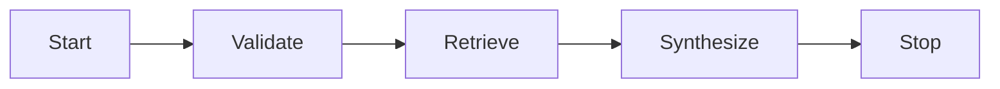

# 🏢 Enterprise RAG System for Technical Documentation


## 📌 Project Overview
מערכת RAG עמידה המבוססת על **Python** ו‑**LlamaIndex**, המיועדת ל‑High‑Precision Querying של תיעוד טכני. הארכיטקטורה נבנתה כדי לספק **Accuracy**, **Stability** ו‑**Enterprise Readiness** גם בסביבות רשת מוגבלות.

## ✨ Key Features
- ⚙️ **Event‑Driven Workflow**: שימוש ב‑LlamaIndex לבניית זרימות Asynchronous מבוססות אירועים.
- 🧭 **Smart Query Routing**: לוגיקה חכמה לניתוב שאילתות לאינדקסים הרלוונטיים ביותר.
- 🛡️ **Engineering Resilience**: טיפול בתעודות SSL לרשתות מסוננות ו‑Local Storage Fallback בעת כשל Pinecone.
- 🎯 **High‑Precision Retrieval**: Embeddings רב‑לשוניים (Cohere/OpenAI) ו‑Structured Extraction מתוך Markdown.

## 🧰 Tech Stack
| Category | Technology | Role |
|---------|------------|------|
| Language | Python | Core development |
| Orchestration | LlamaIndex | RAG orchestration & workflows |
| Vector DB | Pinecone | Vector indexing & retrieval |
| Embeddings | Cohere / OpenAI | Multilingual semantic search |
| LLM | OpenAI | Synthesis & response generation |

## ⚡ Installation
```bash
python -m venv venv
# Windows: venv\Scripts\activate | Mac/Linux: source venv/bin/activate

pip install llama-index-core llama-index-embeddings-cohere llama-index-llms-openai \
  llama-index-vector-stores-pinecone pinecone-client python-dotenv pydantic pip-system-certs
```

## ▶️ Quick Run
```bash
python main.py
python workflow.py
python extractor.py --rebuild
python extractor.py
```# 🚀 Agentic Docs RAG Explorer


## ✨ Executive Summary
מערכת **Enterprise‑grade RAG** לניהול תיעוד Agentic והנגשת ידע צוותי בזמן אמת. הפלטפורמה משלבת **Semantic Retrieval** עם **Event‑Driven Orchestration** כדי לייצר תשובות מדויקות, עקביות ועמידות תחת מגבלות רשת—בדיוק מה שנדרש במערכות Production.

## 🎯 Why This Matters
תיעוד מפוזר בין כלים ומקורות יוצר פער תפעולי בין ידע לבין פעולה. המערכת הזו משמשת כ‑**Central Intelligence** למפתחים: שכבת חיפוש חכמה שמבינה הקשר, מזהה תלות בין רכיבים, ומחזירה תשובות ישימות במהירות.

## 🧠 Core Capabilities
- **Semantic Retrieval** עם Embeddings רב‑לשוניים לשיפור Precision/Recall.
- **Smart Routing** בין Structured Extraction לבין Vector Search לפי סוג Query.
- **Event‑Driven Orchestration** עם State Machine, ולידציות ו‑Routing דינמי.
- **Production‑ready Architecture** מוכנה ל‑Scalability ול‑Asynchronous Workflows.

## 🧭 Architecture (Event‑Driven Workflow)


## 🧰 Tech Stack
| Category | Technology | Role | Notes |
|---------|------------|------|------|
| Orchestration | LlamaIndex | RAG Orchestration & Indexing | Agentic‑ready pipeline |
| LLM / Embeddings | Cohere (embed‑v3.0) | Multilingual Semantic Space | Context‑aware retrieval |
| Vector DB | Pinecone (Serverless) | Scalable Vector Retrieval | Production‑grade |
| HA Fallback Store | SimpleVectorStore | Local Persistence | High‑Availability |
| Validation | Pydantic v2 | Structured Output | Contract safety |
| SSL Handling | pip‑system‑certs | NetFree Compatibility | Adaptive Connectivity |

## 🛡️ Engineering Resilience (NetFree/SSL/Fallback)
- **Network Resilience** עם `pip-system-certs` לתאימות Enterprise CAs ו‑NetFree ללא התאמות ידניות.
- **SSL Handling** ברמת Runtime כיכולת מערכתית.
- **High‑Availability (HA) Fallback** ל‑Local Vector Store כאשר יש Network Constraints (למשל 418) לשמירת Continuity.

## 📦 Installation & Quick Run
```bash
python -m venv venv
# Windows: venv\Scripts\activate | Mac/Linux: source venv/bin/activate

pip install llama-index-core llama-index-embeddings-cohere llama-index-llms-cohere \
  llama-index-vector-stores-pinecone pinecone-client python-dotenv pydantic pip-system-certs

copy .env.example .env   # Windows
# cp .env.example .env    # Mac/Linux

python main.py
python workflow.py
python extractor.py --rebuild
python extractor.py
```

## 🧾 Credits
Course: RAG & Agentic Coding  
Date: March 2026