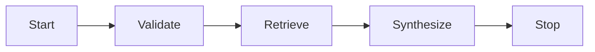

# 🚀 Agentic Docs RAG Explorer


## 📌 Overview
**Problem**: תיעוד Agentic מפוזר ורב‑מקורות מקשה על Context‑aware Querying מדויק בסביבות Enterprise.  
**Solution**: פלטפורמת **Enterprise‑grade RAG** המשלבת **Semantic Retrieval** ו‑**Event‑Driven Orchestration** כדי לספק תשובות עקביות ומהירות גם תחת מגבלות רשת.

## ✨ Key Features
- 🧠 **Semantic Retrieval** עם Vector Embeddings רב‑לשוניים לשיפור Precision/Recall.
- 🧭 **Smart Routing** בין Structured Extraction לבין Vector Search לפי סוג Query.
- ⚙️ **Event‑Driven Orchestration** עם State Machine ו‑Validation בכל שלב.
- 🏗️ **Production‑ready Architecture** מותאמת ל‑Scalability ו‑Asynchronous Workflows.

## 🧭 Architecture


## 🧰 Tech Stack
| Category | Technology | Role | Notes |
|---------|------------|------|------|
| Orchestration | LlamaIndex | RAG Orchestration & Indexing | Agentic‑ready pipeline |
| LLM / Embeddings | Cohere (embed‑v3.0) | Multilingual Semantic Space | Context‑aware retrieval |
| Vector DB | Pinecone (Serverless) | Scalable Vector Retrieval | Production‑grade |
| HA Fallback Store | SimpleVectorStore | Local Persistence | High‑Availability |
| Validation | Pydantic v2 | Structured Output | Contract safety |
| SSL Handling | pip‑system‑certs | NetFree Compatibility | Adaptive Connectivity |

## 🛡️ Engineering Resilience
- **Network Resilience** עם `pip-system-certs` לתאימות Enterprise CAs ו‑NetFree.
- **SSL Handling** ברמת Runtime ללא התאמות ידניות.
- **High‑Availability (HA) Fallback** ל‑Local Vector Store במקרה של Network Constraints (למשל 418).

## 📦 Installation & Quick Run
```bash
python -m venv venv
# Windows: venv\Scripts\activate | Mac/Linux: source venv/bin/activate

pip install llama-index-core llama-index-embeddings-cohere llama-index-llms-cohere \
  llama-index-vector-stores-pinecone pinecone-client python-dotenv pydantic pip-system-certs

copy .env.example .env   # Windows
# cp .env.example .env    # Mac/Linux

python main.py
python workflow.py
python extractor.py --rebuild
python extractor.py
```

## 🧾 Credits
Course: RAG & Agentic Coding  
Date: March 2026